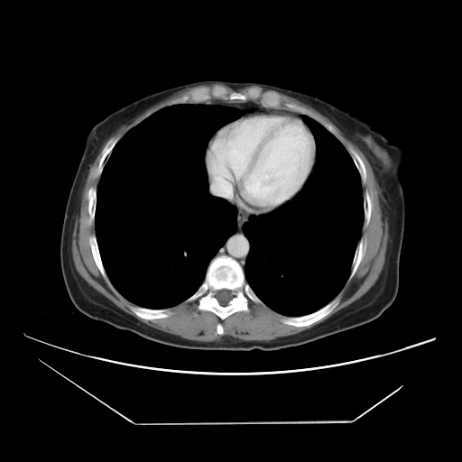

# SALSA: System for Automatic liver Lesion Segmentation And detection


This is the code repository of the liver tumor automatic detection and segmentation tool by Dr. Raquel Perez-Lopez and colleagues from the Radiomics group at the Vall d'Hebron Institute of Oncology (VHIO), Barcelona, Spain.
SALSA-liver is a deep learning based tool for the automatic detection and delineation of liver tumors, this library contains the codes for the pipeline that has been described in our paper (jump to [citation](#citation))


<p align="center">
    
</p>



The whole pipeline is based on the nnU-Net<sup>1</sup> framework, thanks to the authors' effort on making their repository thorough and user-friendly🙏🏼


The results obtained with our pipeline look like this: 
where the  contour is the manual ground truth segmentation (which is not necessary to run SALSA-liver), 
the  line is the liver mask automatically generated by Total Segmentator<sup>2</sup> 
and the  contour is the automatic prediction by SALSA-liver.


### 📢📢📢 **UPDATE (October 2025)** 

In order to obtain SALSA-liver model's weights, please fill out this [form!](https://apps.docusign.com/api/maestro/v1/accounts/a17d1967-477b-4476-b7f3-c8d47b53a934/workflow_definitions/51999945-59bc-43c2-ba4a-2ce689d4f8cf/trigger?hash=ZjEwYWIwOGZmZDk3MWU0ZTg0NzI3MDg4Y2I2ZGVjMzFkMDdmYjI4NTc1ODU4MmM3OTgzN2M3MmIyZmZiNWI2NGNkMGM5ZDI0MjA4ZWIyZmZhZjdlYmJmOGQ2ZDU3OWRkZWE4YmZkYzhiYjMyYWRlYWQ3MWEyNTJjMjkyNjkyZWNhNGNmZWVmODhiMzNhMjMxODNmNjM3MTliOWZmNTBmOWJmMjNhMjk2M2VlNzdlN2M3ZmIxODA3MmJmODliNTVhNjcxMzQzN2E4Mzg3OTFjMDcxMWY0N2I2MDRjNGFkYWVlY2M1Y2Q3OGRlMGM3ODI3M2JlYmRlYzYwZGI2OTAwNA==)

Applications that don't meet the following criteria will be rejected:

1. Using a institutional email address.
2. The applicant and the authorized institutional signee can't be the same individual.
3. Project descriptions not including details such as population size, methodology, or scope of implementation.

Thank you for your understanding!

## Installation
Download or clone this repository as follows, and navigate into the new folder `/liver-SALSA`:

> git clone `https://github.com/radiomicsgroup/liver-SALSA`
>
> cd liver-SALSA

Create a new Python environment (preferably anaconda/miniconda) to ensure compatibility of all dependencies. You can do so easily with `environment.yml` running:

> conda env create -f `environment.yml`
> 
> conda activate salsa

A Docker file is in development for a more swift implementation 🏗️

## Content

The main scripts included in this repo can be explained as follows:

- Folder `demo`:
    - `inference_example.ipynb`: tutorial on how to run the model → _Check it out together with [usage](#usage) :)_ 💃
    - `paths_demo.csv`: an example csv for the tutorial
    - `scanX.nii.gz`: example scans to which I have run SALSA-liver in the tutorial
    - `scanX_SALSA.nii.gz`: resulting SALSA-liver segmentations :)
    - `scanX_GT.nii.gz`: ground truth segmentations of the example scans (just in case you want to check out how it compares to a manual segmentation)


- Folder `src` contains all the code for the pipeline itself, it's subdivided in:
    - `data`: including functions for data pre-processing and post-processing
    - `models`: where the model is placed and script that runs inference
    - `utils`: several functions for basic uses of the pipeline (generate csv, gifs...)


- `run.py`: code to run SALSA-liver

## Usage

Only thing needed to run the pipeline is a csv with 1 column (named *PATHS*), where each row is an absolute path to each scan you want to segment (in NIfTI format: .nii or .nii.gz).
_There is a code in `src/utils` to generate a csv like the one needed._


Then you have to place the model's weights in the `models` folder (after completing the [form](https://apps.docusign.com/api/maestro/v1/accounts/a17d1967-477b-4476-b7f3-c8d47b53a934/workflow_definitions/51999945-59bc-43c2-ba4a-2ce689d4f8cf/trigger?hash=ZjEwYWIwOGZmZDk3MWU0ZTg0NzI3MDg4Y2I2ZGVjMzFkMDdmYjI4NTc1ODU4MmM3OTgzN2M3MmIyZmZiNWI2NGNkMGM5ZDI0MjA4ZWIyZmZhZjdlYmJmOGQ2ZDU3OWRkZWE4YmZkYzhiYjMyYWRlYWQ3MWEyNTJjMjkyNjkyZWNhNGNmZWVmODhiMzNhMjMxODNmNjM3MTliOWZmNTBmOWJmMjNhMjk2M2VlNzdlN2M3ZmIxODA3MmJmODliNTVhNjcxMzQzN2E4Mzg3OTFjMDcxMWY0N2I2MDRjNGFkYWVlY2M1Y2Q3OGRlMGM3ODI3M2JlYmRlYzYwZGI2OTAwNA==)). The correct placement of the model's weights should result in the following folder structure:

```
liver-SALSA
  ├── demo                   
  ├── imgs   
  ├── src                    
  │   ├── data  
  │   ├── model                         
  │   │   ├── model_weights           # SALSA-liver model
  │   │   │   ├── nnUNetTrainer...     
  │   │   │   └── nnUNetTrainer...              
  │   │   ├── __init__.py
  │   │   ├── inference.py
  │   │   └── load_model.py
  │   └── utils
  └── ...
```


Last step is to run the pipeline, calling `run.py:`

`python run.py --input_csv /path/to/csv`


SALSA-liver generates a segmentation mask, also in **.nii.gz format**, for each scan (row in the csv). 
The mask is saved in the same path as the scan and named after it, adding the '_SALSA' extension at the end of the scan's filename.
_(If your scan is named ```/path/to/scan/001_20070321.nii.gz```, the mask will be stored as ```/path/to/scan/001_20070321_SALSA.nii.gz```)_

The code has 2 features to keep in mind:


* `--keep_intermediate_files`:  by default, it is in order to keep/delete all the intermediate files stored in a temporary folder that is generated (useful for debugging purposes)
* `--recist`:  by default, it applies a new layer of post-processing based on RECIST-criteria. If applied, the non-measurable disease will be stored as 2s in the generated mask (instead of just binary)


These intermediate files stored in a tmp folder of the same name as the resulting segmentation (scan filename + '_SALSA'), will be later removed (unless specified in the ``--keep intermediate_files`` flag) as they store intermediate steps only needed for internal processes of the pipeline.
In the ```demo``` folder there are examples of the resulting file structure, but this is what it would look like:

Resulting folder structure with ``--keep intermediate_files == False`` (**default option**)
```
path/to/your/scan1/
  ├── scan1.nii.gz                      # input scan
  └── scan1_SALSA.nii.gz                # resulting SALSA-liver segmentation

path/to/your/scan2/
  ├── scan2.nii.gz                      # input scan
  └── scan2_SALSA.nii.gz                # resulting SALSA-liver segmentation
```

And with ``--keep intermediate_files == True`` 
```
path/to/your/scan1/
  ├── scan1.nii.gz                      # input scan
  ├── scan1_SALSA                       # temporal folder
  │   ├── cropped                           # nnU-Net i/o
  │   │   ├── scan_0000.nii.gz
  │   │   └── mask_0000.nii.gz
  │   ├── liver.nii.gz                      # total segmentator mask
  │   ├── liver_postprocessed.nii.gz
  │   ├── liver_resampled.nii.gz
  │   ├── scan_resampled.nii.gz
  │   └── mask_resampled.nii.gz
  └── scan1_SALSA.nii.gz                # resulting SALSA-liver segmentation

path/to/your/scan2/
  ├── scan2.nii.gz                      # input scan
  ├── scan2_SALSA                       # temporal folder
  │   ├── cropped                           # nnU-Net i/o
  │   │   ├── scan_0000.nii.gz
  │   │   └── mask_0000.nii.gz
  │   ├── liver.nii.gz                      # total segmentator mask
  │   ├── liver_postprocessed.nii.gz
  │   ├── liver_resampled.nii.gz
  │   ├── scan_resampled.nii.gz
  │   └── mask_resampled.nii.gz
  └── scan2_SALSA.nii.gz                # resulting SALSA-liver segmentation
```

----

## License
Please, see `license.txt` and `opensource_manifest.txt`

For the licensing agreement check out the [form](https://apps.docusign.com/api/maestro/v1/accounts/a17d1967-477b-4476-b7f3-c8d47b53a934/workflow_definitions/51999945-59bc-43c2-ba4a-2ce689d4f8cf/trigger?hash=ZjEwYWIwOGZmZDk3MWU0ZTg0NzI3MDg4Y2I2ZGVjMzFkMDdmYjI4NTc1ODU4MmM3OTgzN2M3MmIyZmZiNWI2NGNkMGM5ZDI0MjA4ZWIyZmZhZjdlYmJmOGQ2ZDU3OWRkZWE4YmZkYzhiYjMyYWRlYWQ3MWEyNTJjMjkyNjkyZWNhNGNmZWVmODhiMzNhMjMxODNmNjM3MTliOWZmNTBmOWJmMjNhMjk2M2VlNzdlN2M3ZmIxODA3MmJmODliNTVhNjcxMzQzN2E4Mzg3OTFjMDcxMWY0N2I2MDRjNGFkYWVlY2M1Y2Q3OGRlMGM3ODI3M2JlYmRlYzYwZGI2OTAwNA==)


## Citation
The paper is out!! You can read our article in Cell Reports Medicine [here!!!](https://doi.org/10.1016/j.xcrm.2025.102032) 🚀⭐️🤟🏼

> Balaguer-Montero, M. _et_ al. _A CT-based deep learning-driven tool for automatic liver tumor detection and delineation in patients with cancer._ Cell Reports Medicine, 6(4), 102032 (2025). https://doi.org/10.1016/j.xcrm.2025.102032

This code can be cited as [](https://doi.org/10.5281/zenodo.14644657)


If you have any questions at all please contact Dr. Raquel Perez-Lopez (rperez@vhio.net), Maria Balaguer-Montero (mbalaguer@vhio.net) or Adrià Marcos Morales (adriamarcos@vhio.net).

To know more about our group, visit us at https://radiomicsgroup.github.io

## References
[1] Isensee, F. _et_ al. _nnU-Net: a self-configuring method for deep learning-based biomedical image segmentation._ Nature Methods 18, 203–211 (2021). https://doi.org/10.1038/s41592-020-01008-z

[2] Wasserthal, J. _et_ al. _TotalSegmentator: Robust segmentation of 104 anatomic structures in CT images._ Radiology: Artificial Intelligence, 5(5), e230024 (2023). https://doi.org/10.1148/ryai.230024
